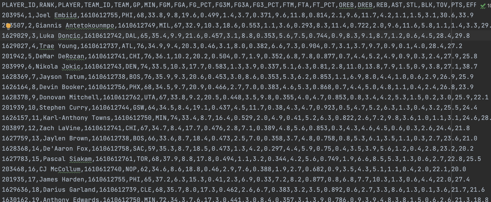

# NBA Score Web Scraper
This is a Python web scraper that can extract score data from the NBA website, specifically from the [Stats page](https://www.nba.com/stats). It uses the requests and BeautifulSoup libraries to send HTTP requests and parse HTML responses.

## Features
This web scraper can extract the following score data from the NBA Stats page:

- Points per game (PPG)
- Rebounds per game (RPG)
- Assists per game (APG)
- Steals per game (SPG)
- Blocks per game (BPG)
The scraper can extract the score data for each player and store it in a CSV file. The CSV file can then be used for further analysis or visualization.

## Installation
1. Clone the repository or download the ZIP file.
2. Run `python nba_score_scraper.py` to start the scraper.
Note: Before running the scraper, make sure that you have the necessary permissions to scrape data from the NBA website. Also, be mindful of the website's terms of service and do not scrape data excessively.

## Usage
Once the scraper has finished running, it will generate a CSV file named nba_scores.csv in the same directory. You can open this file using a spreadsheet software like Microsoft Excel or Google Sheets to view and analyze the score data.

### Here is the data scraped

